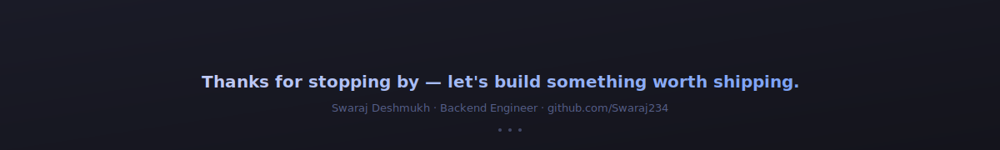

<div align="center">



<br/>

<a href="https://git.io/typing-svg">
  
</a>

<br/><br/>

<a href="https://www.linkedin.com/in/swaraj-tale-58b470294"></a>
<a href="mailto:officialswaraj123@gmail.com"></a>
<a href="https://github.com/Swaraj234"></a>
<!-- <a href="#connect"></a> -->

</div>


<table align="center">
<tr>
<td width="60%" valign="top">

### 👋 About Me

I build backend systems and full-stack products that are meant to run in production, not just in a demo.

My focus is on designing **scalable APIs**, making sound **system design** decisions early, and writing code that stays readable after six other people have touched it. I care about the boring parts most tutorials skip — error handling, data modeling, and the tradeoffs that decide whether a service holds up under real traffic.

Alongside that, I'm actively contributing to **open source** and building **AI-powered applications** that solve problems I've personally run into, like preparing for technical interviews.

I'm currently looking for a **Backend or Full-Stack Engineer** role where I can work on systems that matter and keep getting better at the craft.

</td>
<td width="40%" valign="top">

### 🧭 At a Glance

```
role       backend engineer
based in   india
graduated  information technology
focus      APIs · system design
status     open to work
```

</td>
</tr>
</table>


<h3 align="center">🎯 Current Focus</h3>

<table align="center" width="100%">
<tr>
<td width="20%" align="center">

**🏗️ Building**
<br/><br/>
AI Mock Interview System v2

</td>
<td width="20%" align="center">

**📚 Learning**
<br/><br/>
System Design · AWS

</td>
<td width="20%" align="center">

**🔍 Looking For**
<br/><br/>
Backend / Full-Stack roles

</td>
<td width="20%" align="center">

**🌱 Open Source**
<br/><br/>
Backend & dev-tooling repos

</td>
<td width="20%" align="center">

**🚀 Career Goal**
<br/><br/>
Backend Engineer

</td>
</tr>
</table>


<h3 align="center">🛠️ Tech Stack</h3>

<div align="center">

**Languages**
<br/>


<br/><br/>

**Frontend**
<br/>


<br/><br/>

**Backend**
<br/>


<br/><br/>

**Databases**
<br/>


<br/><br/>

**Cloud & DevOps**
<br/>

<br/>
<sub>AWS &amp; Kubernetes — actively learning</sub>

<br/><br/>

**Tools**
<br/>


<br/><br/>

**Operating Systems**
<br/>


</div>


<h3 align="center">📊 GitHub Analytics</h3>

<div align="center">


<br/>


<br/><br/>


<br/><br/>


</div>

<details>
<summary align="center"><b>📈 Metrics Dashboard (click to expand)</b></summary>
<br/>

<div align="center">

</div>

<sub>Generated automatically by <code>.github/workflows/metrics.yml</code> — see SETUP.md.</sub>

</details>


<h3 align="center">🚀 Featured Projects</h3>

<table align="center" width="100%">
<tr>
<td width="50%" valign="top">


#### 🤖 AI Powered Mock Interview System

AI-driven mock interview platform with live speech-to-text, facial emotion detection, and confidence scoring — built to help candidates practice with real feedback instead of guesswork.

**Key Features**
- AI-generated interview questions
- Real-time speech-to-text
- Automated AI feedback
- Facial emotion detection
- Confidence analysis


<a href="https://github.com/Swaraj234/ai-powered-mock-interview-system"></a>
<a href="#"></a>

</td>
<td width="50%" valign="top">


#### 💬 Real-Time Chat Application

A full-duplex messaging app built on the MERN stack with Socket.IO, supporting authenticated sessions and instant delivery across a clean, responsive interface.

**Key Features**
- Secure authentication
- Real-time messaging via WebSockets
- Fully responsive UI
- Persistent conversation history


<a href="https://github.com/Swaraj234/chat-app-byswaraj"></a>
<a href="#"></a>

</td>
</tr>
<tr>
<td width="50%" valign="top">


#### 💍 Matrimonial Platform

A full-featured matrimonial web platform with authenticated profiles, a modern management dashboard, and a responsive experience across devices.

**Key Features**
- Secure user authentication
- Rich profile management
- Modern, data-driven dashboard
- Fully responsive UI


<a href="https://github.com/Vishalp2685/natejulva"></a>
<a href="#"></a>

</td>
<td width="50%" valign="top">

#### 📌 More on GitHub

Pinned repositories showcase the projects above along with smaller experiments, contributions, and works in progress.

<br/>

<a href="https://github.com/Swaraj234?tab=repositories"></a>

</td>
</tr>
</table>


<h3 align="center">🗺️ Timeline</h3>

<div align="center">

</div>


<h3 align="center">🌱 Open Source</h3>

<table align="center" width="100%">
<tr>
<td width="25%" align="center">

**Current Contributions**
<br/><br/>
Documentation fixes and small functional patches on public repositories

</td>
<td width="25%" align="center">

**Repositories**
<br/><br/>
<a href="https://github.com/Swaraj234?tab=repositories">Browse repos →</a>

</td>
<td width="25%" align="center">

**Goals**
<br/><br/>
Land a meaningful PR in a backend or dev-tooling project

</td>
<td width="25%" align="center">

**How I Contribute**
<br/><br/>
Find real issues, read the codebase first, submit focused PRs

</td>
</tr>
</table>


<h3 align="center">🏆 Achievements</h3>

<div align="center">


<br/>


</div>


<h3 align="center">🏗️ Now Building</h3>

<table align="center" width="100%">
<tr>
<td width="25%" align="center">🤖<br/><b>AI Mock Interview<br/>System v2</b></td>
<td width="25%" align="center">📐<br/><b>System Design<br/>Practice</b></td>
<td width="25%" align="center">⚙️<br/><b>Backend APIs<br/>&amp; Services</b></td>
<td width="25%" align="center">🌐<br/><b>Open Source<br/>Contributions</b></td>
</tr>
</table>

<h3 align="center">📚 Current Learning</h3>

<table align="center" width="100%">
<tr>
<td width="16.6%" align="center"><br/><sub>AWS</sub></td>
<td width="16.6%" align="center"><br/><sub>Docker</sub></td>
<td width="16.6%" align="center"><br/><sub>Kubernetes</sub></td>
<td width="16.6%" align="center"><br/><sub>Redis</sub></td>
<td width="16.6%" align="center">🧠<br/><sub>System Design</sub></td>
<td width="16.6%" align="center">🧩<br/><sub>Microservices</sub></td>
</tr>
</table>


<h3 id="connect" align="center">🔗 Connect With Me</h3>

<div align="center">

<a href="https://www.linkedin.com/in/swaraj-tale-58b470294"></a>
<a href="mailto:officialswaraj123@gmail.com"></a>
<a href="https://github.com/Swaraj234"></a>

<br/><br/>


</div>


